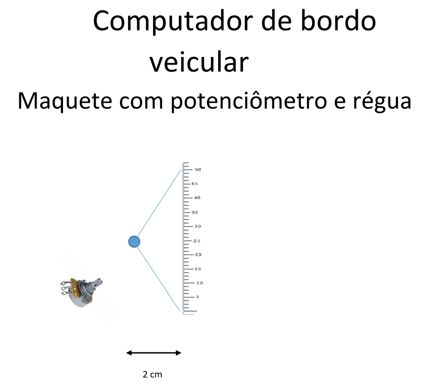

# TB2-Microprocessadores-I

Este projeto tem como objetivo a implementação de um firmware embarcado utilizando microcontrolador ARM com arquitetura 32-bits. Para isso, foi escolhida a placa de desenvolvimento Blue-Pill, com microcontrolador STM32F103C8.
O projeto consiste em reproduzir o funcionamento de um computador de bordo veicular, que deve mostrar as informações em um display LCD 16x2, administrar a injeção de combustível no motor via um sinal PWM, informar sobre erros, entre outras funcionalidades.
***

## Requisitos de projeto
O projeto apresenta diversos requisitos referentes ao funcionamento do computador de bordo. Abaixo estão detalhados os principais requisitos do projeto.

***
1. **Periféricos**
- O projeto deverá possuir 1 display LCD 16x2, 4 botões, 2 LED's e 1 buzzer, além de uma saída PWM de 50 Hz. 
- O display deve apresentar dados sobre velocidade instantânea, velocidade média, quilometragem (hodômetro) e alerta de falhas (temperatura e combustível).

***
2. **Botões do painel**
- Devem ser previstos 2 botões para interagir com o painel do dispositivo. Esses botões devem prever as capacidades de trocar entre as informações exibidas e zerar valores, sendo o processo geral definido pela interface implementada pelo programador.

***
3. **Botões do acelerador e freio**
- Outros dois botões devem ser usados para simular os pedais do acelerador e freio.
- Quando precionado, o acelerador aumenta o duty cycle em 50% a cada 0,5 s.
- O botão do freio diminui o duty cycle em 50% a cada 0,5 s.

***
4. **Comportamento sem os pedais**
- Caso nenhum pedal esteja precionado, o duty cycle deve diminuir 10% a casa 1 s.

***
5. **Cálculo da velocidade**
- O carro deve ser capaz de mostrar duas velocidades: a velocidade instantânea e a velocidade média.
- Velocidade instantânea: a velocidade instantânea possua uma relação de 1:1 com o duty cycle e é atualizado a cada 0,5 s (ex. 55% = 55 km/h).
- Velocidade média: é calculado a cada 1 s como resultado da média da velocidade nesse intervalo de tempo (ex. 60% e 70% = 65 km/h).
- Limpeza de cantos: limpa o perímetro do ambiente, deslocando-se continuamente em um mesmo sentido.

***
6. **Cálculo hodômetro**
- A distância total percorrida é calculada a partir da velocidade média.
- Ex.: 1 s à 90 km/h = 25 m.

***
7. **Monitoramento de temperatura**
- O dispositivo deve esr capaz de medir a temperatura do "motor". Para isso, será utilizado o sensor de temperatura interno do chip. Deve ser feita a leitura da temperatura a cada 50 ms.
- Temperaturas entre 35 °C e 50 °C. Caso a temperatura estiver maior do 50 °C  por mais de 0,2 s (cinco leituras), o dispositivo entrar em alerta, acinando o LED amarelo, mostrando a mensagem no display e acionando o buzzer por 2 s a cada 30 s.
- Caso o sistema permaneça em condições críticas por mais de 3 minutos, o carro deve parar de ler o acelerador e ir parando.

***
8. **Monitoramento de combustível**
- O computador de bordo deve monitorar o nível de combustível. Para simular a boia do nível, será utilizado uma maquete com potenciômetro. A leitura deve ser feita a cada 0,1 s e a média deverá ser mostrada a cada 20 s.

- O tanque tem capacitade total de 50 L. Caso a capacidade esteja abaixo de 4 L, deve ser ativado o LED de alerta amarelo.

***
9. **Cálculo de autonomia**
- Para o cálculo da projeção da autonomia, deve ser considerado que são gastos 4 µL de combustível por cada 10 % de duty cycle a cada ciclo (20 ms).
- Ex. 30% gastam 12 µL a cada 20 ms.
- Deve ser possível também monitorar a qualidade do combustível. Para isso, o motorista deve poder selecionar uma opção no painel de comando que calcule a autonomia real do combustível até aquele momento, sendo a qualidade calculada conforme a tabela a seguir.

| Qualidade | Consumo |
| :-------- | :------ |
| Bom       | Maior ou igual a 13 km/L |
| Regular   | Entre 8 km/L e 13 km/L   |
| Ruim      | Abaixo de 8km/L          |